========
Plotting
========

Scatter Graphs
--------------

Simple Plot
~~~~~~~~~~~

After executing a census one can use the ``plot`` function to create a
scatter graph of results. The ``x`` axis is the location along the
genome (with ordered chromosomes or contigs appearing sequentially) and
the ``y`` axis is the value of the censused region according to the
strategy used. The example below plots GC content ratio across the first
three chromosomes of the ``hs37d5`` reference sequence, with a window
size of 100,000 and a step or overlap of 50,000. Note that the plot
title may be specified with the ``title`` keyword argument. ::

    from goldilocks import Goldilocks
    from goldilocks.strategies import GCRatioStrategy

    sequence_data = {
        "my_sequence": {"file": "/store/ref/hs37d5.1-3.fa.fai"},
    }
    g = Goldilocks(GCRatioStrategy(), sequence_data, length="100K", stride="50K", is_faidx=True)
    g.plot(title="GC Content over hs37d5 Chr1-3")

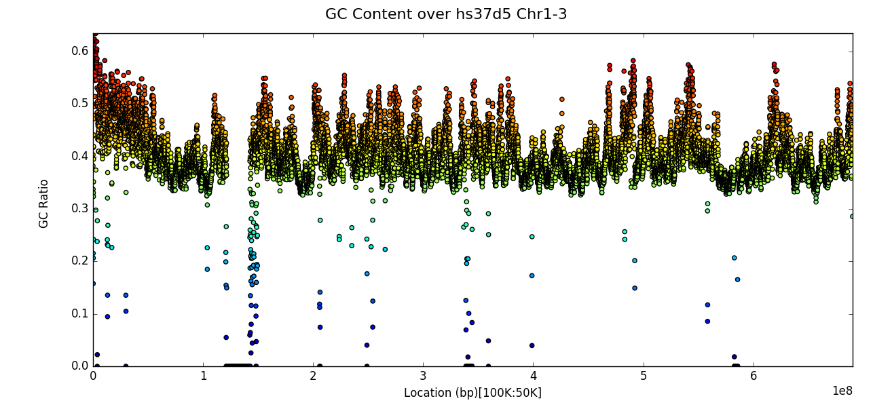

Line Graphs
-----------

Plot multiple contigs or chromosomes from one sample
~~~~~~~~~~~~~~~~~~~~~~~~~~~~~~~~~~~~~~~~~~~~~~~~~~~~

For long genomes or a census with a small window size, simple plots as
shown in the previous section can appear too crowded and thus difficult
to extract information from. One can instead plot, for a given input
sample, a panel of census region data, by chromosome by specifying the
name of the sample as the first parameter to the ``plot`` function as
per the example below: ::

    from goldilocks import Goldilocks
    from goldilocks.strategies import GCRatioStrategy

    sequence_data = {
        "hs37d5": {"file": "/store/ref/hs37d5.1-3.fa.fai"},
        "GRCh38": {"file": "/store/ref/Homo_sapiens.GRCh38.dna.chromosome.1-3.fa.fai"},
    }
    g = Goldilocks(GCRatioStrategy(), sequence_data, length="1M", stride="250K", is_faidx=True)
    g.plot("hs37d5", title="GC Content over hs37d5 Chr1-3")

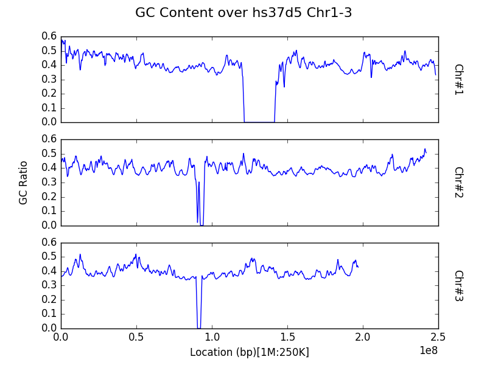

Note that both the ``x`` and ``y`` axes are shared between all panels to
avoid the automatic creation of graphics with the potential to mislead
readers on a first glance by not featuring the same axes ticks.

Plot a contig or chromosome from multiple samples
~~~~~~~~~~~~~~~~~~~~~~~~~~~~~~~~~~~~~~~~~~~~~~~~~

By default, data within the census is aggregated by region across all
input samples (in the ``sequence_data`` dictionary) for the entire
genome. However, one may be interested in comparisons across samples,
rather than between chromosomes in a single sample. One can plot the
census results for a specific contig or chromosome for each of the input
samples, by specifying the ``chrom`` keyword argument to the ``plot``
function. Take note that the argument refers to the sequence that
appears as the i’th contig of each of the input FASTA and not the actual
name or identifier of the chromosome itself. ::

    from goldilocks import Goldilocks
    from goldilocks.strategies import GCRatioStrategy

    sequence_data = {
        "hs37d5": {"file": "/store/ref/hs37d5.1.fa.fai"},
        "GRCh38": {"file": "/store/ref/Homo_sapiens.GRCh38.dna.chromosome.1.fa.fai"},
    }
    g = Goldilocks(GCRatioStrategy(), sequence_data, length="1M", stride="250K", is_faidx=True)
    g.plot(chrom=1, title="GC Content over Chr1")

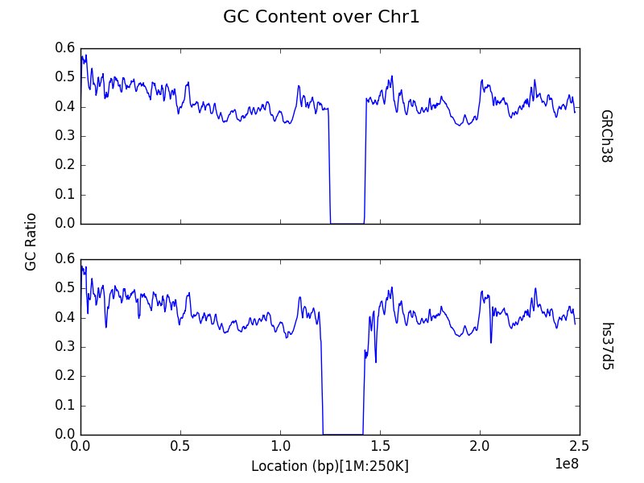

Histograms
----------

Simple profile (binning) plot
~~~~~~~~~~~~~~~~~~~~~~~~~~~~~

Rather than inspection of individual data points, one may want to know
how census data behaves as a whole. The ``plot`` function provides
functionality to *profile* the results of a census through a histogram.
Users can do this by providing a list of bins to the ``bins`` keyword
argument of the ``plot`` function, following a census.

The example below shows the distribution of GC content ratio across the
``hs37d5`` reference sequence for all 100Kbp regions (and step of
50Kbp). The ``x`` axis is the bin and the ``y`` axis represents the
number of censused regions that fell into a particular bin. ::

    from goldilocks import Goldilocks
    from goldilocks.strategies import GCRatioStrategy

    sequence_data = {
        "my_sequence": {"file": "/store/ref/hs37d5.fa.fai"}
    }

    g = Goldilocks(GCRatioStrategy(), sequence_data,
            length="100K", stride="50K", is_faidx=True)

    g.plot(bins=[0.0, 0.1, 0.2, 0.3, 0.4, 0.5, 0.6, 0.7, 0.8, 0.9, 1.0],
        title="GC Content Profile of hs37d5"
    )

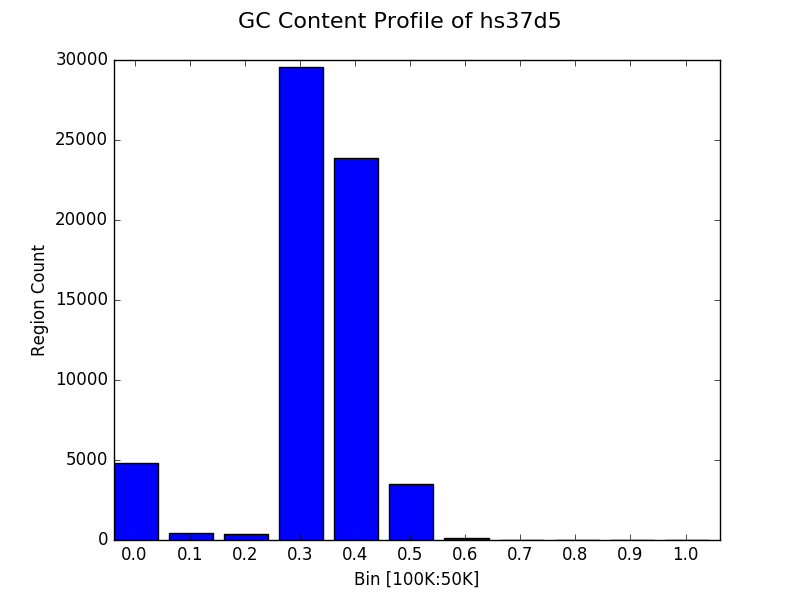

Simpler profile (binning) plot
~~~~~~~~~~~~~~~~~~~~~~~~~~~~~~

It’s trivial to select some sensible bins for the plotting of GC content
as we know that the value for each region must fall between 0 and 1.
However, many strategies will have an unknown minimum and maximum value
and it can thus be difficult to select a suitable binning strategy
without resorting to trial and error.

Thus the ``plot`` function permits a single integer to be provided to
the ``bins`` keyword instead of a list. This will automatically create
:math:`N+1` equally sized bins (reserving a special bin for 0.0) between
0 and the maximum observed value for the census. It is also possible to
manually set the size of the largest bin with the ``bin_max`` keyword
argument. The following example creates the same graph as the previous
subsection, but without explicitly providing a list of bins. ::

    from goldilocks import Goldilocks
    from goldilocks.strategies import GCRatioStrategy

    sequence_data = {
        "my_sequence": {"file": "/store/ref/hs37d5.fa.fai"},
    }
    g = Goldilocks(GCRatioStrategy(), sequence_data, length="100K", stride="50K", is_faidx=True)
    g.plot(bins=10, bin_max=1.0, title="GC Content Profile of hs37d5")

Proportional bin plot
~~~~~~~~~~~~~~~~~~~~~

Often it can be useful to compare the size of bins in terms of their
proportion rather than raw counts alone. This can be accomplished by
specifying ``prop=True`` to ``plot``. The ``y`` axis is now the
percentage of all regions that were placed in a particular bin instead
of the raw count. ::

    from goldilocks import Goldilocks
    from goldilocks.strategies import GCRatioStrategy

    sequence_data = {
        "my_sequence": {"file": "/store/ref/hs37d5.fa.fai"}
    }

    g = Goldilocks(GCRatioStrategy(), sequence_data,
            length="100K", stride="50K", is_faidx=True)
    g.plot(bins=10, bin_max=1.0, prop=True, title="GC Content Profile of hs37d5")

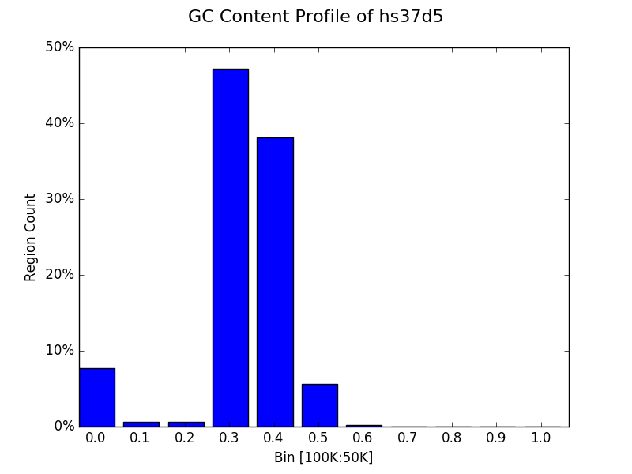

Bin multiple contigs or chromosomes from one sample
~~~~~~~~~~~~~~~~~~~~~~~~~~~~~~~~~~~~~~~~~~~~~~~~~~~

As demonstrated with the line plots earlier, one may also specify a
sample name as the first parameter to ``plot`` to create a figure with
each contig or chromosome’s histogram on an individual panel. ::

    from goldilocks import Goldilocks
    from goldilocks.strategies import GCRatioStrategy

    sequence_data = {
        "my_sequence": {"file": "/store/ref/hs37d5.1-3.fa.fai"}
    }

    g = Goldilocks(GCRatioStrategy(), sequence_data,
            length="100K", stride="50K", is_faidx=True)

    g.plot("my_sequence",
        bins=10, bin_max=1.0, prop=True, title="GC Content Profiles of hs37d5 Chrs 1-3")

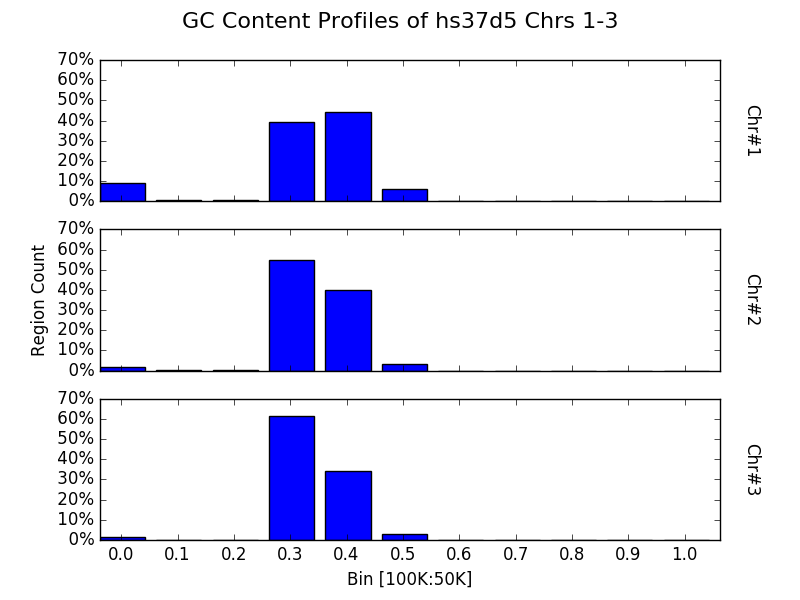

Bin a contig or chromosome from multiple samples
~~~~~~~~~~~~~~~~~~~~~~~~~~~~~~~~~~~~~~~~~~~~~~~~

Similarly, one may want to profile a single contig or chromosome between
each input group as previously demonstrated by the line graphs. ::

    from goldilocks import Goldilocks
    from goldilocks.strategies import GCRatioStrategy

    sequence_data = {
        "hs37d5": {"file": "/store/ref/hs37d5.1.fa.fai"},
        "GRCh38": {"file": "/store/ref/Homo_sapiens.GRCh38.dna.chromosome.1.fa.fai"}
    }

    g = Goldilocks(GCRatioStrategy(), sequence_data,
            length="100K", stride="50K", is_faidx=True)
    g.plot(chrom=1, bins=10, bin_max=1.0, prop=True, title="GC Content Profiles over Chr 1")

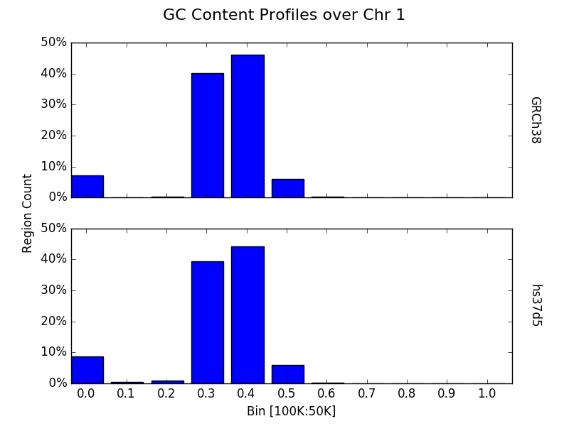

Advanced
--------

Plot data from multiple counting tracks from one sample’s chromosomes
~~~~~~~~~~~~~~~~~~~~~~~~~~~~~~~~~~~~~~~~~~~~~~~~~~~~~~~~~~~~~~~~~~~~~

The examples thus far have demonstrated plotting the results of a
strategy responsible for counting one interesting property. But strategies are capable of counting
multiple targets of interest simultaneously. Of course, one may wish to
plot the results of all tracks rather than just the totals - especially
for cases such as nucleotide counting where the sum of all counts will
typically equal the size of the census region! The ``plot`` function
accepts a list of track names to plot via the ``tracks`` keyword
argument. Each counting track is then drawn on the same panel for the
appropriate chromosome. A suitable legend is automatically placed at the
top of the figure. ::

    from goldilocks import Goldilocks
    from goldilocks.strategies import NucleotideCounterStrategy

    sequence_data = {
        "hs37d5": {"file": "/store/ref/hs37d5.1-3.fa.fai"},
    }

    g = Goldilocks(NucleotideCounterStrategy(["A", "C", "G", "T", "N"]), sequence_data,
            length="1M", stride="500K", is_faidx=True, processes=4)
    g.plot(group="hs37d5", prop=True, tracks=["A", "C", "G", "T", "N"])

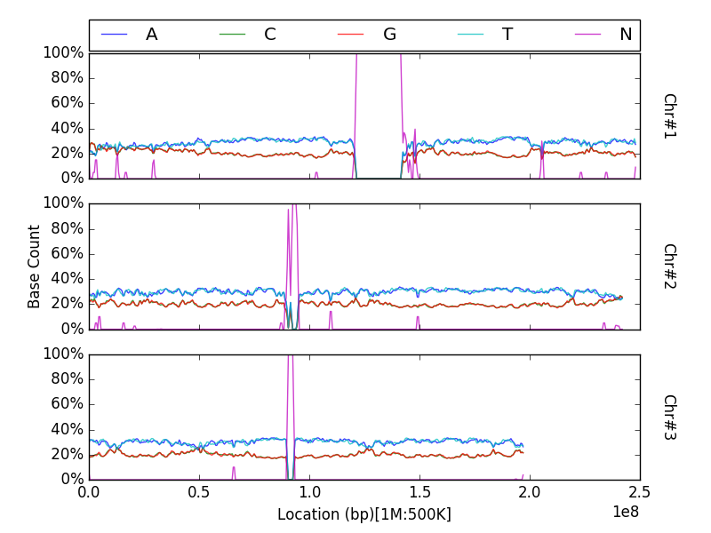

Note that ``prop`` is not a required argument, but can still be used
with the ``tracks`` list to plot counts proportionally.

Plot data from multiple counting tracks for one chromosome across many samples
~~~~~~~~~~~~~~~~~~~~~~~~~~~~~~~~~~~~~~~~~~~~~~~~~~~~~~~~~~~~~~~~~~~~~~~~~~~~~~

As previously demonstrated, one can use the ``chrom`` keyword
argument for ``plot`` to create a figure featuring a panel per input
sample, displaying census results for a particular chromosome.
Similarly, this feature is supported when plotting multiple tracks with
the ``tracks`` keyword. ::

    from goldilocks import Goldilocks
    from goldilocks.strategies import NucleotideCounterStrategy

    sequence_data = {
        "hs37d5": {"file": "/store/ref/hs37d5.1.fa.fai"},
        "GRCh38": {"file": "/store/ref/Homo_sapiens.GRCh38.dna.chromosome.1.fa.fai"},
    }

    g = Goldilocks(NucleotideCounterStrategy(["A", "C", "G", "T", "N"]), sequence_data,
            length="1M", stride="500K", is_faidx=True, processes=4)
    g.plot(chrom=1, prop=True, tracks=["A", "C", "G", "T", "N"])

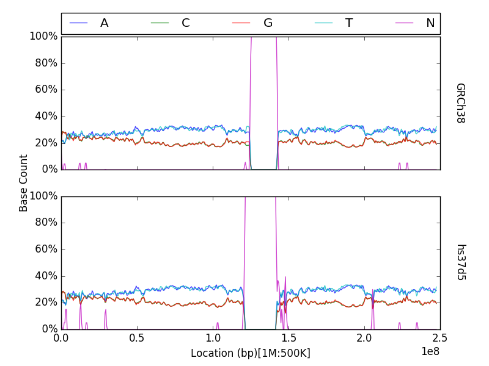

Integration with external plotting tools
----------------------------------------

ggplot2
~~~~~~~

Plotting packages such as ``ggplot2`` favour \`\`melted" input.
The figure below was created using
data from Goldilocks as part of our quality control study, the scatter
plot compares the density of SNPs between the GWAS and SNP chip studies
across the human genome.

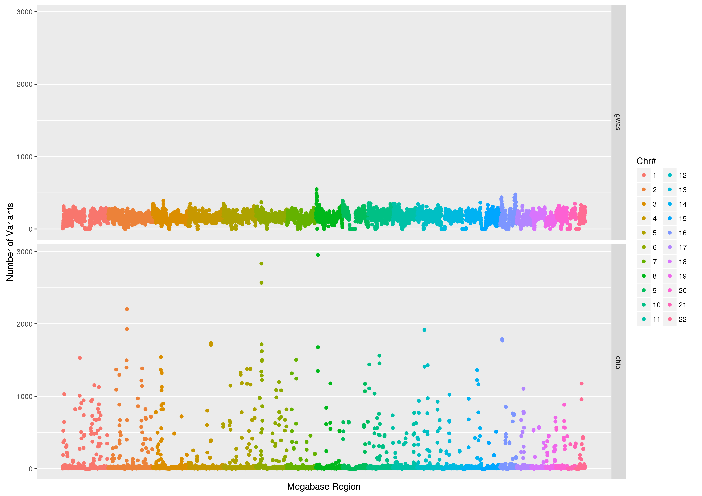

Circos
~~~~~~

Goldilocks has an output format
specifically designed to output information for use with the \`\`popular
and pretty" ``circos`` visualisation tool. Below is an example of a
figure that can be generated from data gathered by Goldilocks. The
figure visualises the selection of regions from our original quality
control study. The Python script used to generate the data and the Circos
configuration follow.

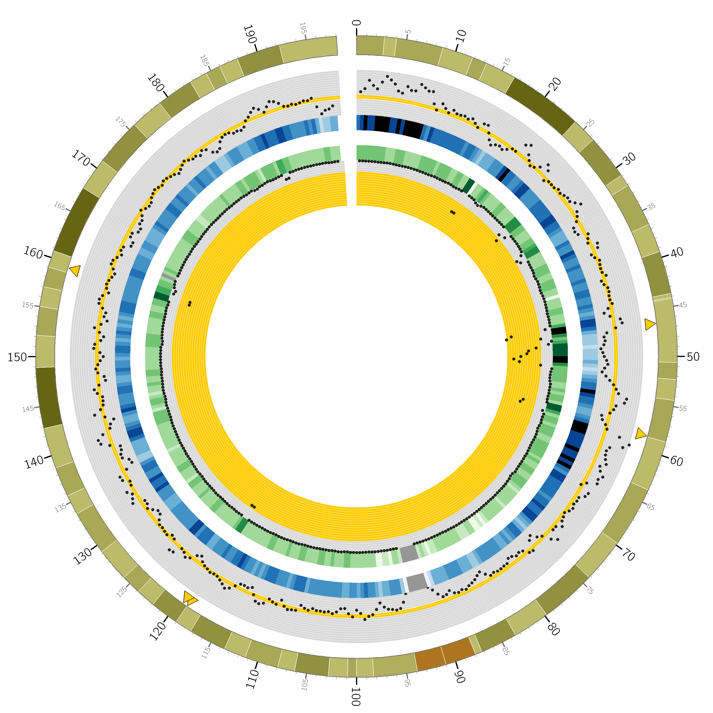

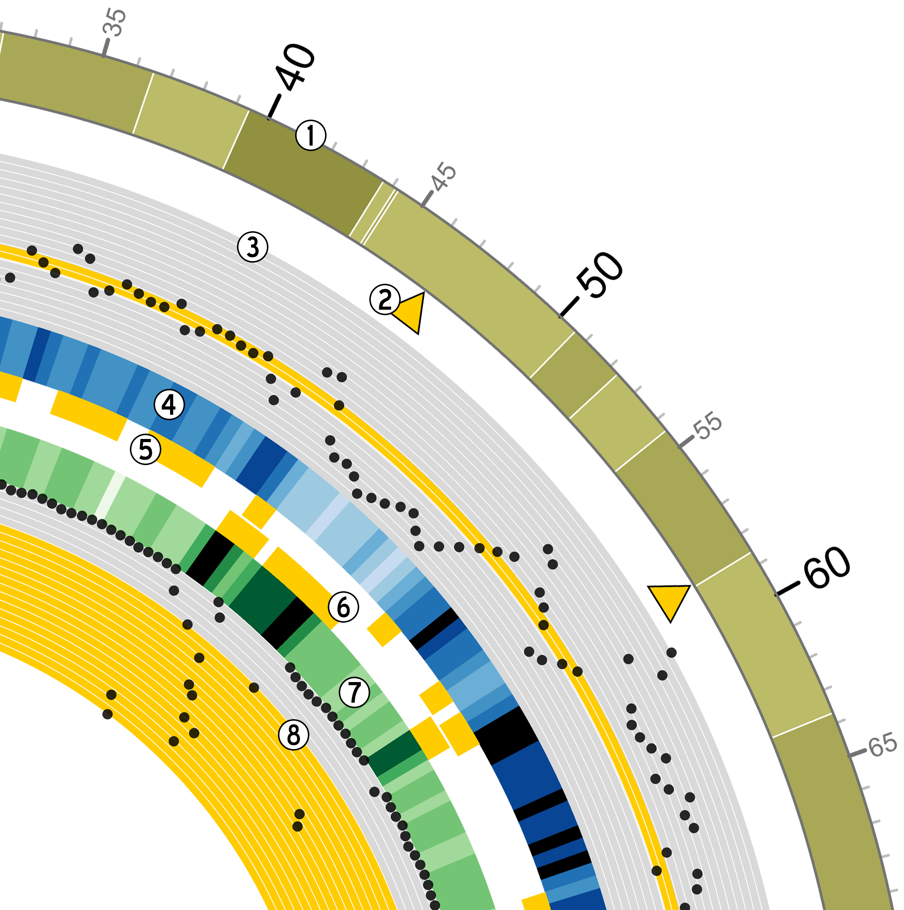

Python script ::

    from goldilocks import Goldilocks
    from goldilocks.strategies import PositionCounterStrategy

    sequence_data = {
        "gwas": {"file": "/encrypt/ngsqc/vcf/cd-seq.vcf.q"},
        "ichip": {"file": "/encrypt/ngsqc/vcf/cd-ichip.vcf.q"},
    }

    g = Goldilocks(PositionCounterStrategy(), sequence_data,
            length="1M", stride="500K", is_pos_file=True)

    # Query for regions that meet all criteria across both sample groups
    # The output file goldilocks.circ is used to plot the yellow triangular indicators
    g.query("median", percentile_distance=20, group="gwas", exclusions={"chr": [6]})
    g.query("max", percentile_distance=5, group="ichip")
    g.export_meta(fmt="circos", group="total", value_bool=True, chr_prefix="hs", to="goldilocks.circ")

    # Reset the regions selected and saved by queries
    g.reset_candidates()

    # Export all region counts for both groups individually
    # The -all.circ files are used to plot the scatter plots and heatmaps
    g.export_meta(fmt="circos", group="gwas", chr_prefix="hs", to="gwas-all.circ")
    g.export_meta(fmt="circos", group="ichip", chr_prefix="hs", to="ichip-all.circ")

    # Export region counts for the groups where the criteria are met
    # The -candidates.circ files are used to plot the yellow 'bricks' that
    #   appear between the two middle heatmaps
    g.query("median", percentile_distance=20, group="gwas")
    g.export_meta(fmt="circos", group="gwas", to="gwas-candidates.circ")
    g.reset_candidates()
    g.query("max", percentile_distance=5, group="ichip")
    g.export_meta(fmt="circos", group="ichip", to="ichip-candidates.circ")
    g.reset_candidates()

Circos configuration ::

    # circos.conf
    <colors>
    gold = 255, 204, 0
    </colors>

    karyotype = data/karyotype/karyotype.human.hg19.txt
    chromosomes_units           = 1000000
    chromosomes_display_default = no
    chromosomes = hs3;

    <ideogram>

    <spacing>
    default = 0.01r
    break   = 2u
    </spacing>

    # Ideogram position, fill and outline
    radius    = 0.9r
    thickness = 80p
    fill      = yes
    stroke_color     = dgrey
    stroke_thickness = 3p

    # Bands
    show_bands = yes
    band_transparency = 4
    fill_bands            = yes
    band_stroke_thickness = 2
    band_stroke_color     = white

    # Labels
    show_label     = no
    label_font       = default
    label_radius     = 1r + 75p
    label_size     = 72
    label_parallel   = yes
    label_case     = upper

    </ideogram>

    # Ticks
    show_ticks          = yes
    show_tick_labels    = yes

    <ticks>

    label_font       = default
    radius               = dims(ideogram,radius_outer)
    label_offset         = 5p
    orientation          = out
    label_multiplier     = 1e-6
    color                = black
    chromosomes_display_default = yes

    <tick>
        spacing = 1u
        size = 10p
        thickness = 3p
        color = lgrey
        show_label = no
    </tick>

    <tick>
        spacing = 5u
        size = 20p
        thickness = 5p
        color = dgrey
        show_label = yes
        label_size = 24p
        label_offset = 0p
        format = %d
    </tick>

    <tick>
        spacing = 10u
        size = 30p
        thickness = 5p
        color = black
        show_label = yes
        label_size = 40p
        label_offset = 5p
        format = %d
    </tick>

    </ticks>

    track_width = 0.05
    track_pad   = 0.02
    track_start = 0.95

    <plots>
    <plot>
        type            = scatter
        file        = goldilocks.circ
        r1      = 0.98r
        r0      = 0.95r
        orientation = out

        glyph = triangle
        #glyph_rotation = 180
        glyph_size = 50p

        color     = gold
        stroke_thickness = 2p
        stroke_color = black

        min = 0
        max = 1

    </plot>
    <plot>
        type  = scatter

        file    = gwas-all.circ
        r1      = 0.95r
        r0      = 0.80r

        fill = no
        fill_color       = black
        color = black_a1
        stroke_color     = black
        glyph            = circle
        glyph_size       = 12

        <backgrounds>
            <background>
                color = vlgrey
                y0    = 207
            </background>
            <background>
                color = vlgrey
                y1    = 207
                y0    = 179
            </background>
            <background>
                color = gold
                y1    = 179
                y0    = 148
            </background>
            <background>
                color = vlgrey
                y1    = 145
                y0    = 122
            </background>
            <background>
                color = vlgrey
                y1    = 122
                y0    = 0
            </background>
        </backgrounds>

        <axes>
            <axis>
                color     = white
                thickness = 1
                spacing   = 0.05r
            </axis>
        </axes>
        <rules>
            <rule>
                condition  = var(value) < 1
                show = no
            </rule>
        </rules>
    </plot>
    <plot>
        type    = heatmap
        file    = gwas-all.circ

        # color list
        color   = grey,vvlblue,vlblue,lblue,blue,dblue,vdblue,vvdblue,black
        r1      = 0.80r
        r0      = 0.75r

        scale_log_base = 0.75
        color_mapping = 2
        min = 1
        max = 267 # 95%
    </plot>

    <plot>
        type            = tile
        layers_overflow = collapse
        file        = gwas-candidates.circ
        r1      = 0.7495r
        r0      = 0.73r
        orientation = in

        layers      = 1
        margin      = 0.0u
        thickness   = 30p
        padding     = 8p

        color     = gold
        stroke_thickness = 0
        stroke_color = gold
    </plot>
    <plot>
        type            = tile
        layers_overflow = collapse
        file        = ichip-candidates.circ
        r1      = 0.73r
        r0      = 0.70r
        orientation = out

        layers      = 1
        margin      = 0.0u
        thickness   = 30p
        padding     = 8p

        color     = gold
        stroke_color = gold
    </plot>

    <plot>
        type    = heatmap
        file    = ichip-all.circ

        # color list
        color   = grey,vvlgreen,vlgreen,lgreen,green,dgreen,vdgreen,vvdgreen,black
        r1      = 0.70r
        r0      = 0.65r

        min = 1
        max = 1097.71 # 99%
        color_mapping = 2
        scale_log_base = 0.2

    </plot>
    <plot>
        type  = scatter

        file    = ichip-all.circ
        r1      = 0.65r
        r0      = 0.50r
        orientation = in

        fill_color       = black
        stroke_color     = black
        glyph            = circle
        glyph_size       = 12
        color = black_a1

        <backgrounds>
            <background>
                color = gold
                y0    = 379
            </background>
            <background>
                color = vlgrey
                y1    = 379
                y0    = 49
            </background>
            <background>
                color = vlgrey
                y1    = 49
                y0    = 0
            </background>
        </backgrounds>

        <axes>
            <axis>
                color     = white
                thickness = 1
                spacing   = 0.05r
            </axis>
        </axes>
        <rules>
            <rule>
                condition  = var(value) < 1
                show = no
            </rule>
        </rules>
    </plot>

    </plots>

    ################################################################
    # The remaining content is standard and required. It is imported 
    # from default files in the Circos distribution.
    #
    # These should be present in every Circos configuration file and
    # overridden as required. To see the content of these files, 
    # look in etc/ in the Circos distribution.

    <image>
    # Included from Circos distribution.
    <<include etc/image.conf>>
    </image>

    # RGB/HSV color definitions, color lists, location of fonts, fill patterns.
    # Included from Circos distribution.
    <<include etc/colors_fonts_patterns.conf>>

    # Debugging, I/O an dother system parameters
    # Included from Circos distribution.
    <<include etc/housekeeping.conf>>
    anti_aliasing* = no
